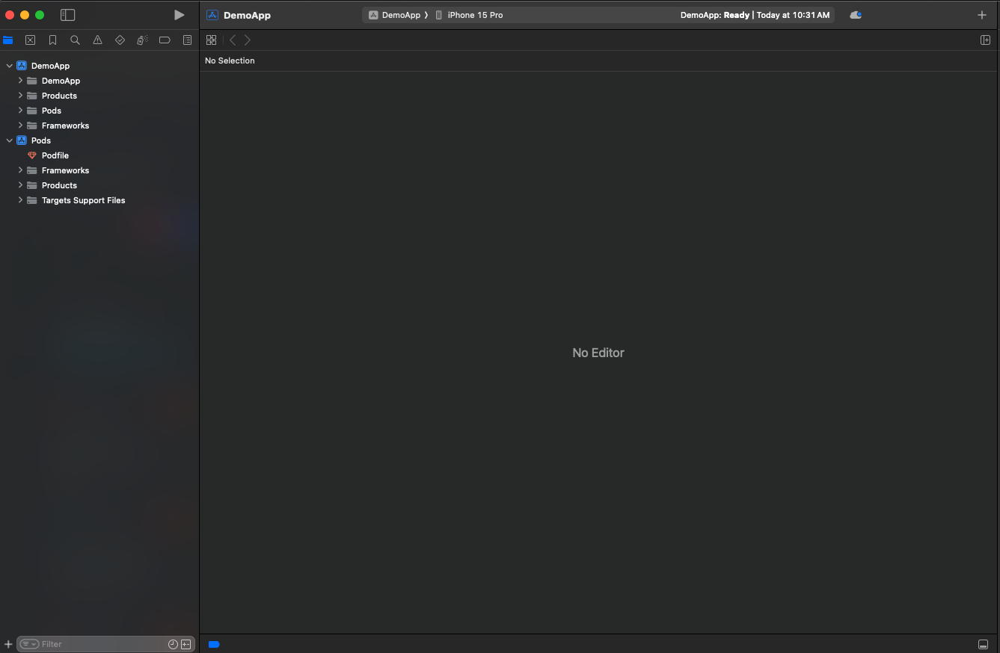

# WEServiceExtension

---

## Installation

WEServiceExtension is available through [CocoaPods](https://cocoapods.org). To install
it, simply add the following below :

## Notification Service Extension Setup

### Add Notification Service Extension

#### Step 1:

In Xcode, navigate to `File` > `New` > `Target` and select `Notification Service Extension` then `Next`

<i>1</i>

<i>2</i>

<i>3</i>

#### Step 2:

Enter the Product Name as `NotificationService`, and click Finish.

<i>4</i>

#### Step 3:

Click Activate on the prompt shown to activate the service extension. Xcode will now create a new top-level folder in your project with the name `NotificationService`.

<i>5</i>

 

<i>If you not activated by accident, you can switch back to debug your app target (middle-top next to the device selector).</i>

---

### Add WebEngage Service Extensions (WEServiceExtension) to the respective Targets

---

Steps to add WebEngage Notification Service(WEServiceExtension)

#### Step 1:

Select your `Project` > `Package Dependencies` > `+` button.
Enter Package URL: `https://github.com/WebEngage/WEServiceExtension.git` in the search bar.

<i>1</i>

<i>2</i>

<i>3</i>

#### Step 2:

Under `Add to Target` select `NotificationService` (Your Service Extension Target).

<i>4</i>

#### Step 3:

Click `Add Package`.

<i>5</i>

<i>6</i>

## License

WEServiceExtension is available under the MIT license. See the LICENSE file for more info.
