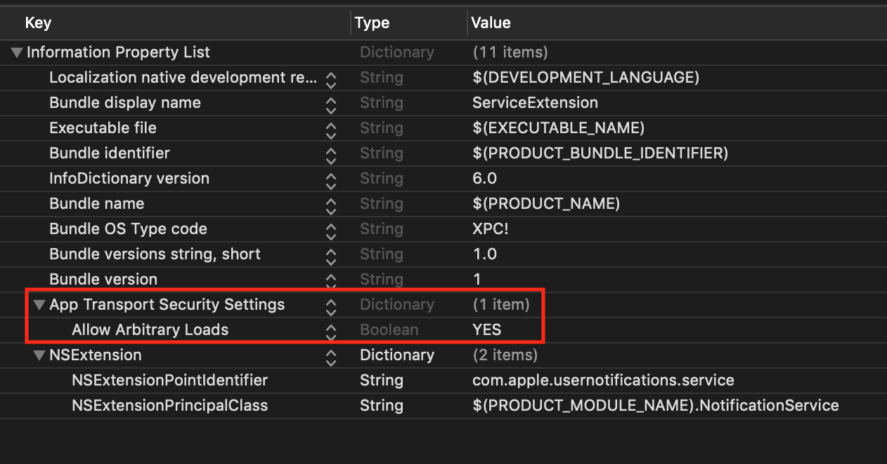

# WEServiceExtension

[](https://cocoapods.org/pods/WEServiceExtension)
[](http://cocoapods.org/pods/WEServiceExtension)
[](http://cocoapods.org/pods/WEServiceExtension)
[](https://cocoapods.org/pods/WEServiceExtension)

---

**Push notification service extensions** in iOS are needed to make notifications more interesting by adding images, videos, or interactive buttons. They also ensure that sensitive tasks, like processing user data, are done securely without affecting the app's performance.

## <!-- Start table -->

### Table of Content

<details>
    <summary>Click to Expand</summary>

- [How to add Service Extension ?](#how-to-add-service-extension-)
- [How to integrate WebEngage into Service Extension ?](#how-to-integrate-webengage-into-service-extension-)
  - [Using Swift Package Manager](#using-swift-package-manager)
  - [Using Cocoapods](#using-cocoapods)
- [Update Service Class](#update-service-class)

  - [Swift](#swift)
  - [Objective C](#objective-c)

- [Add App Groups](#add-app-groups)
- [Configure ServiceExtension-Info.plist](#configure-serviceextension-infoplist)

  </details>
  <!-- End table -->

## <!-- Start Of Step 1 -->

### How to add Service Extension ?

---

#### Step 1:

In Xcode, navigate to `File` > `New` > `Target` and select `Notification Service Extension` then `Next`


#### Step 2

Enter the Product Name as `NotificationService`, and click Finish.


#### Step 3

Click Activate on the prompt shown to activate the service extension. Xcode will now create a new top-level folder in your project with the name `NotificationService`.


<!-- End of Step 1 -->

<hr>

<!-- Start of  -->

### How to integrate WebEngage into Service Extension ?

---

There are two ways to do this.

1. [Using Swift Package Manager]()
2. [Using Cocoapods]()

<hr>

### Using Swift Package Manager

#### Step 1:

Select your `Project` > `Package Dependencies` > `+` button.
Enter Package URL: `https://github.com/WebEngage/WEServiceExtension.git` in the search bar.

```
https://github.com/WebEngage/WEServiceExtension.git
```


#### Step 2:

Under `Add to Target` select `NotificationService` (Your Service Extension Target).


#### Step 3:

Click `Add Package`.


### Using Cocoapods

---

Open `Podfile` and add WebEngage to the `NotificationService` target:

```ruby
target 'NotificationService' do
    # Uncomment the line below if the parent target also uses frameworks
    # use_frameworks!

    pod 'WEServiceExtension'
    # Add other pods for the NotificationService target here
end

```

Now, navigate to your iOS project directory in the terminal and execute:

```shell
pod install
```

<!--  -->

<hr>

## Update Service Class

---

### Swift

```swift
import UserNotifications
// Step 1 : Importing WEServiceExtension
import WEServiceExtension

// Step 2 : Subclassing service Extension
class NotificationService: WEXPushNotificationService {
}

```

### Objective-C

NotificationService.h

```Objective-C
#import <UserNotifications/UserNotifications.h>

@interface NotificationService : UNNotificationServiceExtension

@end
```

NotificationService.m

```Objective-C
#import "NotificationService.h"
// Step 1 : Importing WEServiceExtension
#import <WEServiceExtension/WEServiceExtension-Swift.h>

@interface NotificationService ()
// Step 2 : Creating Object of service Extension
@property (nonatomic, strong) WEXPushNotificationService *serviceExtension;

@end

@implementation NotificationService

// Step 3 : Pass necessary information to WebEngage
- (void)didReceiveNotificationRequest:(UNNotificationRequest *)request withContentHandler:(void (^)(UNNotificationContent * _Nonnull))contentHandler {
    if (_serviceExtension == NULL){
        _serviceExtension = [[WEXPushNotificationService alloc]init];
    }
    [_serviceExtension didReceiveNotificationRequest:request
                                  withContentHandler:contentHandler];
}

- (void)serviceExtensionTimeWillExpire {
    // Called just before the extension will be terminated by the system.
    // Use this as an opportunity to deliver your "best attempt" at modified content, otherwise the original push payload will be used.
    [_serviceExtension serviceExtensionTimeWillExpire];
}

@end
```

### Add App Groups

---

App Groups allow your app and the WebEngageNotificationServiceExtension to communicate when a notification is received, even if your app is not active. This is required for Confirmed Deliveries.

Select your `Main App Target` > `Signing & Capabilitie`s > `+ Capability` > `App Groups`.


Within `App Groups`, click the `+` button.


Set the App Groups container to be group.YOUR_BUNDLE_IDENTIFIER.WEGNotificationGroup where YOUR_BUNDLE_IDENTIFIER is the same as your Main Application "Bundle Identifier".


Press `OK` and repeat for the **`NotificationService`** Target.

<hr>

## Configure ServiceExtension-Info.plist

### Step 1:

Add `App Transport Security Settings` key under `Information Property List` in `NotificationService Info.plist` files.

### Step 2:

Set `Allow Arbitrary` Loads to `YES` under `App Transport Security Settings`

- Not required if you are sure that image URLs provided on `WebEngage` dashboard will always use `https`.



## License

WEServiceExtension is available under the MIT license. See the LICENSE file for more info.

###

<!-- End Of ******************************** -->
